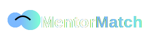

# MentorMatch

<p align="center">
  
</p>

MentorMatch is an innovative platform that connects aspiring professionals with experienced mentors, fostering growth and knowledge sharing in various fields.

## 🚀 Features

- 🧠 AI-powered profile analysis for personalized matching
- 🗺️ Interactive learning path generation
- 💬 Real-time chat and video mentorship sessions
- 📊 Skill assessment and feedback
- 🎯 Progress evaluation and goal tracking
- 🌐 Professional networking hub

## 🛠️ Technologies Used

- React.js
- CSS3 with custom animations
- SVG for responsive logo design
- AI integration for matching and learning path generation

## 🏗️ Project Structure

```
Work in projress...
```


## 🌈 Key Features Explained

1. **AI Profile Analysis**: Our advanced AI analyzes user profiles to create personalized dashboards and matching recommendations.

2. **Interactive Learning Paths**: Customized learning journeys are generated based on user goals and mentor feedback.

3. **Mentorship Sessions**: Seamless chat and video call integration for effective mentor-mentee communication.

4. **Skill Assessment**: Regular evaluations to track progress and adjust learning paths accordingly.

5. **Career Opportunity Matching**: AI-powered job matching based on acquired skills and career goals.

6. **Continuous Learning**: Adaptive system that evolves with the user's growing expertise.

## 🎨 UI/UX Highlights

- Sleek, modern interface with glassmorphism effects
- Responsive design for seamless experience across devices
- Dark mode toggle for comfortable viewing in any environment
- Animated logo and UI elements for enhanced user engagement

## 🚀 Getting Started

1. Clone the repository
2. Run `npm install` to install dependencies
3. Use `npm start` to launch the development server
4. Open `http://localhost:3000` to view the app

## 🤝 Contributing

We welcome contributions to MentorMatch! Please see our [Contributing Guidelines](CONTRIBUTING.md) for more information.

## 📄 License

This project is licensed under the MIT License - see the [LICENSE](LICENSE) file for details.

---

<p align="center">
  Made with ❤️ by the MentorMatch Team
</p>
